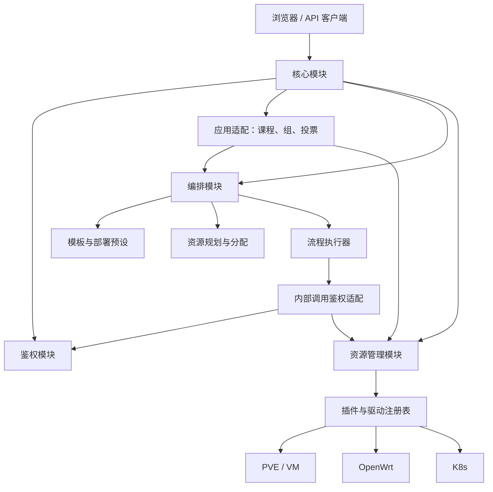
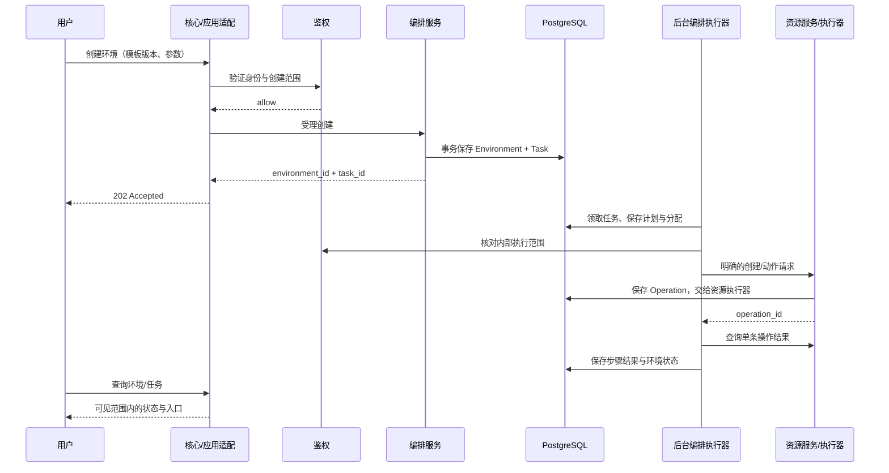

# 整体架构与模块边界

返回[接手指南](README.md)。状态：待实现设计，2026-09-03。

## 1. 借鉴 Kubernetes 的范围

Kubernetes 将 API 接入、持久化、调度和控制器分工处理；本平台借鉴这种职责划分。API Server 对应核心入口，Controller Manager 对应编排任务控制器，Scheduler 对应资源规划组件，etcd 的状态存储角色由 PostgreSQL 承担。它们是架构类比，不表示接口或运行方式相同。[Kubernetes 官方组件说明](https://kubernetes.io/docs/concepts/overview/components/)。

Kubernetes 控制器通过控制循环推动实际状态接近期望状态。本平台首版只推进已受理的任务，未来需要持续协调时将其加入编排层；资源框架始终执行明确命令。[Kubernetes 官方控制器说明](https://kubernetes.io/docs/concepts/architecture/controller/)。

资源模块不是 kubelet 的复刻，不承担“确保环境一直存在”的职责。重启、重载等一次性操作使用命令记录，不能因持续读取期望状态而反复执行。

## 2. 逻辑结构



图中箭头表示模块调用。数据由对应模块通过自己的 repository 读写，共用 PostgreSQL 不等于任意跨模块修改表。核心统一暴露外部入口，内部不要求绕回 HTTP，可直接调用服务接口。

## 3. 四个模块的输入与输出

| 模块 | 输入 | 输出 | 自有状态 |
|---|---|---|---|
| 核心 | HTTP/Socket.IO 请求 | 响应、任务引用、用户范围内的事件 | 请求追踪与访问审计，不保存第二份业务状态 |
| 鉴权 | 登录凭据，或规范化的主体/动作/目标/范围/参数 | 身份、allow/deny、原因、查询范围 | 用户、角色、权限/会话；首版适配现有模型 |
| 资源管理 | 资源 ID + 动作 + 参数，或明确类型/连接的创建请求 | Resource、Observation、Operation | 资源身份、绑定、连接、实际观察、单条操作 |
| 编排 | 固定模板版本、参数、环境/生命周期请求 | Environment、Plan、Task、访问入口 | 模板、预设、环境、分配、步骤和环境资源关联 |

创建资源时还没有 resource_id：调用者提交 type、driver_id、connection_id 和完整参数；框架先生成资源 ID，再执行插件创建。登记已有对象、创建外部对象、关闭登记、删除外部对象分别处理。

## 4. 核心保持轻量

核心完成认证入口、请求解析、路由与响应适配。创建实验交给 EnvironmentService，修改模板交给 TemplateService，资源重启交给经鉴权的 ResourceService 调用适配。

核心不解析模板步骤，不选择服务器，不自行编写等待循环，不直接调用 PVE/OpenWrt 客户端。HTML、JSON 和 Socket.IO 可以复用同一应用服务，避免不同入口产生不同权限或业务规则。

登录是身份验证入口，不要求预先登录；其他需要身份的请求先建立主体，再授权。批量查询、事件订阅、任务日志和 WebSSH 也需要各自的对象范围判断。

## 5. 鉴权与教学规则

鉴权接受可序列化请求上下文，主体来自服务端会话或已验证的内部身份，不采用请求正文声明的角色。资源/环境的归属从其所属服务读取；资源框架中的 labels 不是授权事实来源。

“这个学生是否能操作此环境”属于鉴权；“共享关机投票是否通过”属于教学应用规则；“先关 VM 再删除”属于流程定义。三个判断不加入资源插件。

编排后台调用也经过宿主侧的鉴权适配，使用限定于本任务计划和环境的执行范围。资源框架仍只收到不透明 caller_ref/request_id 等追踪信息。具体受理与撤权语义见[接口契约](contracts.md)。

## 6. 编排内部按职责拆分

| 内部组件 | 职责 | 不做 |
|---|---|---|
| TemplateService | 模板草稿、发布、版本、参数描述 | 执行资源操作 |
| ProfileService | 管理部署位置、连接/镜像/网络池的版本化预设 | 保存连接凭据正文 |
| EnvironmentService | 受理生命周期请求，维护环境记录和访问输出 | 实现底层驱动 |
| Planner | 绑定具体连接/节点/镜像，预留地址和编号，生成明确步骤 | 发送创建/删除命令 |
| TaskController | 领取任务、恢复进度、推进阶段 | 猜测课程业务意图 |
| WorkflowExecutor | 顺序执行已生成步骤、等待结果、记录失败 | 自动发现资源依赖或生成补偿策略 |
| ReadinessEvaluator | 按模板指定条件检查环境可用性 | 在资源框架中修改操作完成定义 |

它们是普通 Python 组件，共属编排模块，首版不分别部署。流程顺序由模板/已注册配方给出，规划器负责展开与绑定。首版支持顺序步骤和明确等待，不建设通用流程平台。

拓扑重复（例如 N 个 K8s worker）由规划阶段按有上限的资源数量展开为有限步骤；运行时执行器不运行任意循环。环境删除使用明确的销毁配方，不让资源层按关系自动级联。

## 7. 资源层及四插件

| 插件 | 设计边界 |
|---|---|
| virtual_machine | 定义 compute.vm/v1 及 create/start/stop/reboot/configure/delete 契约 |
| pve | 平台/节点/镜像查询，提供 pve.qemu/v1 驱动；一台 VM 只登记一次 |
| openwrt | 独立连接下的 VLAN、interface、DHCP、zone、端口转发及服务命令 |
| k8s | 集群登记与 API 查询，接收完整 inventory 的 kubeasz 安装操作 |

VM create 不隐式开机，delete 不隐式关机；OpenWrt 删除 interface 不隐式清理其他配置；K8s deploy 不创建网络或 VM。单一资源动作内部必要的 clone→等待→配置、安装器文件准备等协议步骤可以由插件实现。

资源管理只判断指令能否解析、目标能否定位、动作是否支持，并如实返回平台结果。外部平台拒绝、部分成功和结果不明均保留事实，不转换成隐式业务决策。详细设计以[资源框架文档](../resource-framework/README.md)为准。

## 8. 两条调用路径



直接重启已有资源则走核心/应用适配→鉴权与适用业务规则→资源服务，返回 operation_id，不生成部署任务。面向学生的受控业务动作不能被通用资源 API 绕过：原始资源命令使用单独授权，教学动作走相应应用入口。

## 9. 运行与依赖

建议目标包结构（不代表当前已存在）：

```text
modules/
  core/                   # HTTP、事件、请求适配和启动装配
  auth/                   # 身份、授权与旧用户模型适配
  orchestration/
    templates/            # 模板与版本
    profiles/             # 部署预设
    environments/         # 环境服务
    planning/             # 分配与步骤展开
    workflow/             # 任务控制、步骤执行、就绪判断
    persistence/           # 编排自有记录
  application_adapters/   # 课程/组、投票、旧 API、内部鉴权
  resource_integration/   # 资源初始化、凭据及 HTTP 适配
resource_framework/       # 无 Flask/课程模型依赖的资源库
resource_plugins/         # virtual_machine、pve、openwrt、k8s
```

首版一个 API 进程和一个后台 worker 进程，worker 内区分编排推进和资源操作执行。二者调用同一资源库及其持久化接口；开发时可以同进程运行，但禁止通过模块导入隐式启动重复 worker。长时间外部任务通过轮询推进，不长期占住编排调度线程。

队列事实来源为 PostgreSQL 中的任务/操作记录，进程内队列只能用于唤醒。各进程显式装配数据库连接与插件。凭据通过连接的 secret_ref 解析，模板和计划只引用凭据，不复制正文。

扩展多个 worker 前，必须补齐数据库领取租约、资源域互斥和故障恢复。跨进程后不能继续依赖 threading.Lock 保证 OpenWrt 写入串行。首版的线程数是配置项，不等于 HA 保证。

## 10. 状态协调的演进

Environment 可以保存用户请求的生命周期目标与实际 phase；资源记录只保存已知配置、观察值和观察时间。两层状态语义分离。

首版资源被外部删除时，观察接口报告不存在，编排状态刷新可标记环境异常，不自动补建。以后需要自愈，由独立的环境协调器检查策略并生成新任务。任何协调器都通过资源命令接口执行，不给资源核心增加业务控制循环。
