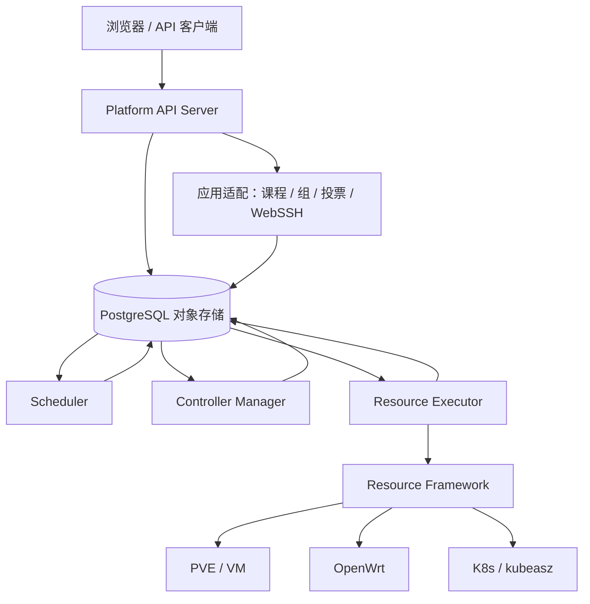

# 整体架构与控制循环

返回[接手指南](README.md)。状态：待实现设计，2026-09-04。

## 1. 借鉴 Kubernetes 的范围

本平台借鉴 Kubernetes control plane 的对象协作和控制循环：API Server 管理对象入口，Scheduler 观察未绑定对象并做 placement，Controller 持续比较 spec/status，执行器隔离真实副作用。PostgreSQL 承担持久状态角色，不复制 etcd、kubelet 或 Kubernetes API。

借鉴的语义包括 metadata/spec/status、resourceVersion、generation/observedGeneration、conditions、finalizer、lease、LIST/WATCH 和定期 full resync。首版不照搬集群部署方式、任意 CRD、Leader Election、多副本高可用或默认自愈。

Resource Framework 不是 kubelet。它是 PVE、OpenWrt、K8s 等异构后端的受信任执行库，只完成明确单资源命令及协议内部步骤。

## 2. 逻辑结构



箭头表示对象读写或外部执行，不表示同步函数调用链。API 提交对象后立即结束请求；Scheduler、Controller 和 Executor 通过数据库中的 resourceVersion、状态、lease 和确定性键协作。事务 outbox 与 PostgreSQL LISTEN/NOTIFY 可用于唤醒，但任何通知丢失都由定期 LIST/resync 修复。

## 3. 五个角色的输入与输出

| 角色 | 输入 | 输出 | 自有职责 |
|---|---|---|---|
| API Server | HTTP/Socket.IO、会话、对象变更请求 | 已提交对象、202/查询响应、授权范围内的状态和事件 | AuthN/AuthZ、validation、admission、spec CRUD、resourceVersion 冲突、审计 |
| PostgreSQL | 事务写入、状态更新、lease/outbox | 持久化对象、LIST 查询、变更通知 | 所有控制面事实，不执行业务逻辑 |
| Scheduler | 未调度的 Environment generation、模板需求、DeploymentProfile、容量观察 | Placement、Allocation、Scheduled condition | Filter、Score、Reserve、Bind |
| Controller Manager | Environment/Placement/PlanRevision/Resource/Operation status | 新 PlanRevision、确定性 Operation、conditions、finalizer/GC 进度 | reconcile spec/status，不直接访问外部平台 |
| Resource Executor | Pending/Running/Pending-external Operation | Operation status、Resource binding/status、外部任务事实 | 领取、目标冻结、插件执行、poll、cancel、日志脱敏 |

数据表有唯一写入语义，而不是“谁都可以直接更新所有字段”：API 主要写 spec/metadata，Scheduler 写 placement/allocation status，Controller 写 PlanRevision 和对象 status，Executor 写 Operation 执行状态及 Resource 技术事实。repository 通过列级服务方法和比较更新维护边界。

## 4. 对象模型：metadata、spec 与 status

Environment 示例：

```yaml
apiVersion: lab.platform/v1
kind: Environment
metadata:
  uid: 11111111-1111-4111-8111-111111111111
  generation: 3
  resourceVersion: "18372"
  deletionTimestamp: null
  finalizers:
    - lab.platform/environment-cleanup
spec:
  templateRef: {name: k8s-lab, version: 1.2.0}
  profileRef: {name: teaching-lab, revision: 4}
  parameters: {controlPlanes: 1, workers: 3}
  desiredState: running
  recoveryPolicy: retain_and_block
status:
  observedGeneration: 2
  phase: provisioning
  activePlacementRef: placement-1
  activePlanRef: plan-2
  conditions:
    - {type: Scheduled, status: "True"}
    - {type: InfrastructureReady, status: "True"}
    - {type: NetworkReady, status: "True"}
    - {type: SoftwareReady, status: "False", reason: WaitingForKubernetes}
    - {type: Ready, status: "False"}
```

规则：

- spec 表示已授权并持久化的期望；status 只表示 controller 已观察到的事实。
- 修改 spec 递增 generation；任何对象写入递增 resourceVersion。
- controller 处理完当前 spec 后才更新 observedGeneration。
- phase 是摘要，conditions 才是可诊断事实；不能只靠 phase 决定资源是否存在。
- status 更新不得反向修改 spec，也不能把外部命令成功等同于 Environment Ready。

Resource 也采用已知配置与观察状态分离，但资源框架不持续收敛业务 desired spec。Resource 的 `registrationState` 与 `existenceState=pending/present/absent/unknown` 分开，支持 create 预分配 UUID 和部分失败。

## 5. 声明式对象与一次性命令

适合 reconcile 的对象：Environment、Placement、Allocation、PlanRevision 的激活状态、Resource 登记与观察状态。

一次性副作用必须创建 Operation：clone、start、stop、reboot、configure、delete、UCI commit/reload/restart、K8s deploy 等。Operation 从 Pending 进入 Running/Pending/Succeeded/Failed/Cancelled/Unknown，终态不会因下一次 resync 自动重新执行。

Controller 使用确定性 operation key，例如：

```text
environment_uid / intent_generation / plan_revision / plan_item / attempt
```

重复 reconcile 只能取得同一 Operation。用户从 Stopped 再次改为 Running 会产生新的 generation，因此可以创建新的 start Operation；同一 generation 不会重复。只有明确的新 attempt、spec generation 或恢复决策才产生新 Operation。禁止以 `spec.reboot=true`、`spec.reload=true` 等布尔目标表示一次性动作。

## 6. Scheduler 与 PlanBuilder

Scheduler 只回答“放在哪里”。它以调度相关 spec 的规范化 `schedulingInputDigest` 判断 Placement 是否仍可复用；只改变 desiredState 不重新调度：

```text
Environment.spec + Profile + Capacity
        ↓ Filter / Score / Reserve / Bind
Placement + Allocation
```

它选择 domain、connection、node、镜像绑定，并预留 VMID、IP、VLAN、端口。Scheduler 不生成资源命令，也不调用 PVE/OpenWrt/K8s。

PlanBuilder 是 Controller Manager 内的确定性组件：读取固定模板版本、预设版本和 Placement，生成不可变 `PlanRevision`。它把有上限的拓扑展开为有限 plan items，并保存资源声明、依赖顺序、就绪条件、访问描述、失败策略和 cleanup recipe。

PlanRevision 不是跨进程传递文件，而是数据库中的一等控制面对象。它以模板、Profile、Placement 和计划相关参数的 `planInputDigest` 判断是否可复用；desiredState 切换通常复用同一 plan，只用新 generation 产生相应 Operation。发生 VMID 冲突时，只有证据确认命令未产生目标、没有在途外部任务且授权仍有效，才允许安全重排：旧 plan 标为 Superseded，核实后释放旧 allocation，Scheduler 产生新 Placement，PlanBuilder 创建新 revision；否则 allocation 隔离并 blocked。旧 plan 和 Operation 永远保留。

## 7. Controller Manager

首版逻辑 controller：

| Controller | 责任 |
|---|---|
| EnvironmentController | 比较 Environment spec/status，选择当前 PlanRevision，创建下一项确定性 Operation，更新 conditions |
| PlanController | 调用 PlanBuilder，激活/替换 PlanRevision，核对 plan item 与资源关联 |
| AllocationController | 维护 reserved/assigned/quarantined/released；unknown 时禁止释放 |
| ObservationController | 安排只读观察并更新 stale/observedAt，不把缓存当命令完成证据 |
| FinalizerController | deletionTimestamp 后推进 cleanup recipe，所有外部结果确认后移除 finalizer |
| TaskProjectionController | 将 Environment/Plan/Operation 聚合为用户可读进度，不驱动执行 |
| GarbageCollector | 按保留策略清理可安全删除的事件/日志投影，不删除审计和仍可重试的去重事实 |

每个 controller 提供 `reconcile(key)`，一次只做有限工作：读取最新对象、计算差异、以比较更新创建或修改一个确定性对象，然后返回。不得在数据库事务内等待网络，也不得依赖“上一个函数已经调用过我”。

首版失败策略默认 `retain_and_block`。Controller 遇到 Failed/Unknown、身份不匹配、权限撤销或无法证明安全的重规划时设置 condition 并停止产生新副作用，不自动反转旧操作。

## 8. 删除与 finalizer

删除 Environment 时，API 校验权限并设置 deletionTimestamp，不直接删除数据库记录。`lab.platform/environment-cleanup` finalizer 保持对象可见，FinalizerController 按固定 cleanup recipe：

1. 停止需要停止的 VM；
2. 删除明确由环境创建且负责清理的资源；
3. 移除 OpenWrt 配置和 K8s 登记；
4. 确认外部对象不存在；
5. 释放 allocation；
6. 移除 finalizer，并将 Environment 转为删除 tombstone/归档状态。

借用资源不自动删除。任何 delete Operation 为 Unknown、外部对象仍可能存在或 allocation 仍可能被占用时，finalizer 必须保留。finalizer 不是插件级联删除；每个副作用仍是独立 Operation。

## 9. 授权与应用规则

API Server 是用户入口的授权边界。Principal、课程/组归属和目标对象均从服务端事实构造，客户端标签、caller_ref、task_id 或 resource_id 不授予权限。

Environment 每次 spec generation 保存发起主体、授权范围摘要和服务端 execution grant 引用。Controller 在创建每一条新的变更 Operation 前通过 `ExecutionAuthorizationGate` 重新加载主体、环境归属及策略：

- 授权仍有效：以受限 service identity 创建 Operation；
- 权限撤销：设置 `ReconciliationBlocked/AuthorizationRevoked`，不再提交新命令；
- 已被外部平台接受的 Operation：Executor 继续跟踪事实，不承诺撤回。

关机投票等应用规则在 API/admission 阶段完成。学生不能通过通用资源 API 绕过投票；直接资源命令使用单独权限并同样落为 Operation。

## 10. Resource Executor 与资源框架

Executor 从 PostgreSQL 领取 Operation，使用 lease_owner、lease_until 和 claimRevision 防止旧 worker 覆盖新状态。受理事务中固定：binding_id/revision、connection_id/revision、secret version ref、plugin/driver version、规范化输入及摘要。

create 在发送外部命令前生成 resource_id 和 provisional binding。外部 identity 可预知时先占用 `(domain,driver,external_key)` 唯一键；崩溃后可按该身份核对事实。Executor 将 Result、externalTaskRef、execData 和阶段性结果保存后释放线程，后续 poll 继续原 Operation。

Resource Framework 不读取 Environment、PlanRevision、课程、角色或 finalizer。它只执行 Operation 中已经固定的技术目标。详细契约见[资源框架架构](../resource-framework/architecture.md)。

## 11. WATCH、队列与恢复

PostgreSQL 表是事实来源。对象事务同时写 outbox；提交后可发 LISTEN/NOTIFY。各 controller/executor 的基本循环是：

```text
启动 LIST 未收敛对象
→ 收到通知 enqueue key
→ reconcile/execute
→ 周期 full resync
```

进程内队列只保存 key 并用于削峰，丢失不影响正确性。worker 重启从数据库恢复 lease 过期对象；lease 过期不证明网络调用未发送，Running 且提交结果不明的 Operation 必须进入 Unknown 或通过已保存 externalTaskRef 恢复 poll，不能直接重发。

## 12. 首版物理部署与包结构

首版两个进程：

- API 进程：Platform API Server、应用适配、查询和事件输出；
- control-plane worker：Scheduler、Controller Manager、Resource Executor 和资源框架宿主。

它们只通过 PostgreSQL 对象协作，不互相回调。开发环境可以在同一进程显式装配，但导入模块不能自动启动 worker。

```text
modules/
  api/                    # AuthN/AuthZ、validation、admission、CRUD、watch
  control_plane/
    scheduler/            # filter、score、reserve、bind
    controllers/          # environment、plan、allocation、finalizer、projection
    plans/                # template/profile → immutable PlanRevision
    persistence/          # 对象 repository、resourceVersion、outbox、lease
  application_adapters/   # 课程、组、投票、旧 API、WebSSH
  resource_integration/   # Executor 装配、凭据与事件适配
resource_framework/       # 无 Flask/课程依赖的资源库
resource_plugins/         # virtual_machine、pve、openwrt、k8s
```

长时间任务通过 Operation 外部作业标识轮询，不能长期占住调度线程。扩展多 worker 前必须验证 lease fencing、每资源变更互斥、OpenWrt domain 跨进程串行和旧领取者写入拒绝。

## 13. 状态协调范围

首版控制循环负责可靠推进已授权 generation、恢复中断、更新观察和阻止不安全清理；它不默认自动修复所有外部漂移。外部删除已经 Ready 的 VM 时，ObservationController 报告 absent，EnvironmentController 设置 Drifted/Blocked。未来启用自动补建时，通过显式 recoveryPolicy 和新 PlanRevision/Operation 实现，不能让资源插件自行重建。
