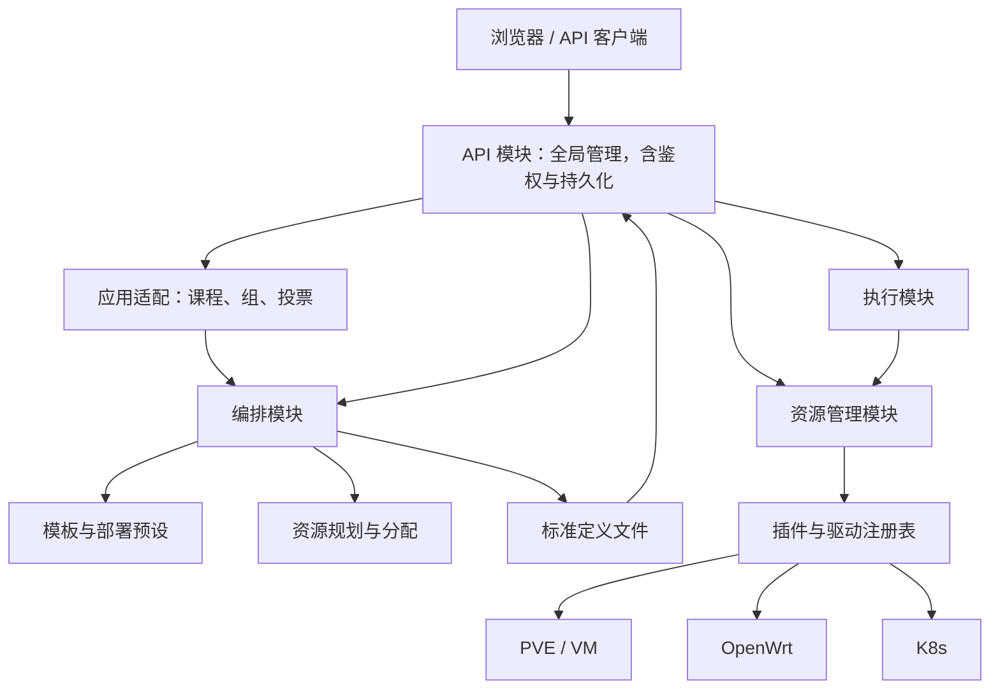
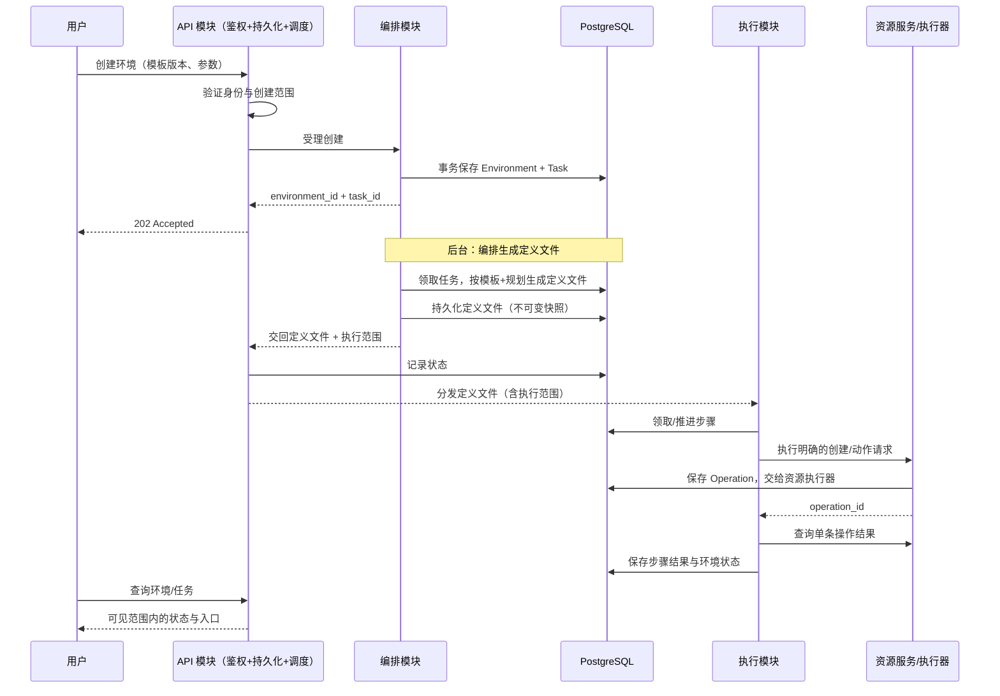

# 整体架构与模块边界

返回[接手指南](README.md)。状态：待实现设计，2026-09-04。

## 1. 借鉴 Kubernetes 的范围

Kubernetes 将 API 接入、持久化、调度和控制器分工处理；本平台借鉴这种职责划分。API Server 对应 API 模块（统一入口、鉴权、定义文件持久化与全局调度分发），Controller Manager 对应执行模块（消费定义文件、推进任务），Scheduler 对应编排模块中的资源规划组件，etcd 的状态存储角色由 PostgreSQL 承担。它们是架构类比，不表示接口或运行方式相同。[Kubernetes 官方组件说明](https://kubernetes.io/docs/concepts/overview/components/)。

Kubernetes 控制器通过控制循环推动实际状态接近期望状态。本平台首版只推进已受理的任务，未来需要持续协调时将其加入执行层；资源框架始终执行明确命令。[Kubernetes 官方控制器说明](https://kubernetes.io/docs/concepts/architecture/controller/)。

资源模块不是 kubelet 的复刻，不承担“确保环境一直存在”的职责。重启、重载等一次性操作使用命令记录，不能因持续读取期望状态而反复执行。

## 2. 逻辑结构



图中箭头表示模块调用。API 模块是唯一中枢：统一外部入口、鉴权、定义文件持久化与全局调度分发。编排模块依据模板生成标准定义文件并交回 API；API 存储定义文件、记录状态，并分发给执行模块；执行模块消费定义文件、调用资源管理模块执行资源命令。编排与资源管理之间不直接互调。数据由对应模块通过自己的 repository 读写，共用 PostgreSQL 不等于任意跨模块修改表。内部调用不要求绕回 HTTP，可直接调用服务接口。

## 3. 四个模块的输入与输出

| 模块 | 输入 | 输出 | 自有状态 |
|---|---|---|---|
| API | HTTP/Socket.IO 请求、编排交回的定义文件 | 响应、任务引用、用户范围内的事件、分发到执行模块的定义文件、分发到资源的直接指令 | 请求追踪与访问审计、鉴权状态（用户/角色/权限/会话）、定义文件与任务状态记录，不保存第二份业务状态 |
| 编排 | 固定模板版本、参数、环境/生命周期请求 | Environment、标准定义文件、Task（受理）、访问入口 | 模板、预设、环境、分配、定义文件 |
| 执行 | 定义文件（含执行范围） | 步骤推进、Operation 关联、环境状态更新 | 任务步骤、执行进度、就绪判断结果 |
| 资源管理 | 资源 ID + 动作 + 参数，或明确类型/连接的创建请求 | Resource、Observation、Operation | 资源身份、绑定、连接、实际观察、单条操作 |

鉴权不再是独立模块，而是 API 模块的内建能力：身份验证、授权、可见范围与执行范围核对均由 API 完成。编排不再携带执行功能，执行功能独立成执行模块。创建资源时还没有 resource_id：调用者提交 type、driver_id、connection_id 和完整参数；框架先生成资源 ID，再执行插件创建。登记已有对象、创建外部对象、关闭登记、删除外部对象分别处理。

## 4. API 模块是全局中枢

API 模块承担全局管理：统一认证入口、鉴权、请求解析、路由、响应适配、定义文件持久化与全局调度分发。创建实验交给编排受理并生成定义文件，定义文件交回 API 后持久化到数据库、记录状态，再由 API 分发给执行模块；直接资源指令由 API 经鉴权后分发给 ResourceService。

API 模块不解析模板步骤，不选择服务器，不自行编写等待循环，不直接调用 PVE/OpenWrt 客户端。HTML、JSON 和 Socket.IO 复用同一 API 入口与同一套应用服务，避免不同入口产生不同权限或业务规则。

登录是身份验证入口，不要求预先登录；其他需要身份的请求先建立主体，再授权。批量查询、事件订阅、任务日志和 WebSSH 也需要各自的对象范围判断。

## 5. 鉴权与教学规则

鉴权是 API 模块的内建能力，不再是独立模块。现有 `modules/authz.py` 已提供无 Flask 依赖的授权策略，`modules/security_service.py` 已实现主体/对象重载及服务层授权。它们作为 API 模块的鉴权组件被复用；HTTP、Socket.IO、worker 和 WebSSH 的既有授权边界及审计继续复用。

鉴权接受可序列化请求上下文，主体来自服务端会话或已验证的内部身份，不采用请求正文声明的角色。资源/环境的归属从其所属服务读取；资源框架中的 labels 不是授权事实来源。

“这个学生是否能操作此环境”属于鉴权；“共享关机投票是否通过”属于教学应用规则；“先关 VM 再删除”属于流程定义。三个判断不加入资源插件。

API 在把定义文件分发给执行模块前，核对限定于本任务和环境的执行范围，并将执行范围随定义文件下发；执行模块持该范围调用资源管理，资源框架仍只收到不透明 caller_ref/request_id 等追踪信息。具体受理与撤权语义见[接口契约](contracts.md)。

## 6. 编排与执行按职责拆分

编排模块只生成标准定义文件，不携带执行功能。

| 内部组件（编排） | 职责 | 不做 |
|---|---|---|
| TemplateService | 模板草稿、发布、版本、参数描述 | 执行资源操作 |
| ProfileService | 管理部署位置、连接/镜像/网络池的版本化预设 | 保存连接凭据正文 |
| EnvironmentService | 受理生命周期请求，维护环境记录和访问输出 | 实现底层驱动 |
| Planner | 绑定具体连接/节点/镜像，预留地址和编号，展开步骤 | 发送创建/删除命令 |
| DefinitionBuilder | 将规划输出组装为不可变的标准定义文件 | 执行步骤、推进状态 |

执行模块消费定义文件，负责推进任务与执行资源命令。

| 内部组件（执行） | 职责 | 不做 |
|---|---|---|
| TaskController | 领取任务、恢复进度、推进阶段 | 猜测课程业务意图 |
| StepExecutor | 顺序执行定义文件中的步骤、等待结果、记录失败 | 生成定义文件、自动发现资源依赖或生成补偿策略 |
| ReadinessEvaluator | 按定义文件指定条件检查环境可用性 | 在资源框架中修改操作完成定义 |

它们是普通 Python 组件，首版不分别部署。流程顺序由定义文件给出，规划器负责展开与绑定。首版支持顺序步骤和明确等待，不建设通用流程平台。

编排生成标准定义文件后交回 API，由 API 持久化并分发执行。执行模块是资源管理模块的主要消费方（直接资源指令除外），编排不直接联系资源管理，也不跨过 API 直接驱动执行。

拓扑重复（例如 N 个 K8s worker）由规划阶段按有上限的资源数量展开为有限步骤；运行时执行器不运行任意循环。环境删除使用明确的销毁配方，不让资源层按关系自动级联。

## 7. 标准定义文件

定义文件是编排产出的标准化、可序列化、不可变的声明式方案，`api_version=lab.definition/v1`。它是模板与规划针对一次实验实例的展开结果，绑定具体资源、地址与编号；模板是可复用配方，定义文件是实例化的执行蓝图，二者不能混为一谈。

| 字段 | 语义 |
|---|---|
| metadata.id / version | 定义文件标识与版本 |
| environment_ref / template_ref / profile_ref | 关联环境、固定模板/预设版本 |
| parameters_snapshot | 校验并填充默认值后的参数快照 |
| resources | 逻辑资源名到类型/驱动/连接及创建/借用方式的声明 |
| steps | 展开后的顺序步骤（resource.create/action/register、wait.observation、wait.endpoint） |
| readiness | 就绪检查条件 |
| access | 访问入口描述 |
| failure_policy | 失败策略（首版 retain） |
| execution_scope | 限定于本任务/环境的执行范围引用 |

定义文件持久化后不可原地修改；运行中的环境固定使用生成时的定义文件版本，模板或预设的后续升级不影响既有环境。资源命令的稳定 request_id、caller_ref 等追踪信息在执行模块分发时产生，不写入定义文件正文。

## 8. 资源层及四插件

| 插件 | 设计边界 |
|---|---|
| virtual_machine | 定义 compute.vm/v1 及 create/start/stop/reboot/configure/delete 契约 |
| pve | 平台/节点/镜像查询，提供 pve.qemu/v1 驱动；一台 VM 只登记一次 |
| openwrt | 独立连接下的 VLAN、interface、DHCP、zone、端口转发及服务命令 |
| k8s | 集群登记与 API 查询，接收完整 inventory 的 kubeasz 安装操作 |

VM create 不隐式开机，delete 不隐式关机；OpenWrt 删除 interface 不隐式清理其他配置；K8s deploy 不创建网络或 VM。单一资源动作内部必要的 clone→等待→配置、安装器文件准备等协议步骤可以由插件实现。

资源管理只判断指令能否解析、目标能否定位、动作是否支持，并如实返回平台结果。外部平台拒绝、部分成功和结果不明均保留事实，不转换成隐式业务决策。详细设计以[资源框架文档](../resource-framework/README.md)为准。

## 9. 两条调用路径



直接重启已有资源则走 API 模块→鉴权与适用业务规则→资源服务，返回 operation_id，不生成定义文件与部署任务。面向学生的受控业务动作不能被通用资源 API 绕过：原始资源命令使用单独授权，教学动作走相应应用入口。

## 10. 运行与依赖

建议目标包结构（不代表当前已存在）：现有 `authz.py`、`security_service.py`、`audit.py` 和 `credential_store.py` 可以先保持位置并通过适配接入，不要求先重命名或重写。鉴权组件归属 API 模块，audit/credential_store 作为资源连接与日志的宿主适配。

```text
modules/
  api/                    # 统一入口、鉴权、路由、定义文件持久化、全局调度分发和启动装配
  orchestration/
    templates/            # 模板与版本
    profiles/             # 部署预设
    environments/         # 环境服务
    planning/             # 分配与定义文件生成
    persistence/           # 编排自有记录（模板/预设/环境/定义文件）
  execution/              # 执行模块：任务控制、步骤执行、就绪判断
    controller/           # 领取任务、恢复进度
    steps/                # 步骤执行器
    readiness/            # 就绪判断
  application_adapters/   # 课程/组、投票、旧 API
  resource_integration/   # 资源初始化、凭据及 HTTP 适配
resource_framework/       # 无 Flask/课程模型依赖的资源库
resource_plugins/         # virtual_machine、pve、openwrt、k8s
```

首版一个 API 进程和一个后台 worker 进程。API 进程承载 API 模块：统一入口、鉴权、定义文件持久化与全局调度分发；worker 进程承载编排模块（生成定义文件）与执行模块（执行资源命令、推进任务）。二者调用同一资源库及其持久化接口；开发时可以同进程运行，但禁止通过模块导入隐式启动重复 worker。长时间外部任务通过轮询推进，不长期占住执行调度线程。

队列事实来源为 PostgreSQL 中的任务/操作记录，进程内队列只能用于唤醒。各进程显式装配数据库连接与插件。凭据通过连接的 secret_ref 解析，模板和定义文件只引用凭据，不复制正文。宿主适配复用 `modules/credential_store.py` 的加密/解密及 `modules/audit.py` 的脱敏处理；新 SecretStore 接口不替代现有密钥管理与显式迁移机制。

扩展多个 worker 前，必须补齐数据库领取租约、资源域互斥和故障恢复。跨进程后不能继续依赖 threading.Lock 保证 OpenWrt 写入串行。首版的线程数是配置项，不等于 HA 保证。

## 11. 状态协调的演进

Environment 可以保存用户请求的生命周期目标与实际 phase；资源记录只保存已知配置、观察值和观察时间。两层状态语义分离。

首版资源被外部删除时，观察接口报告不存在，执行状态刷新可标记环境异常，不自动补建。以后需要自愈，由独立的环境协调器检查策略并生成新任务。任何协调器都通过资源命令接口执行，不给资源核心增加业务控制循环。
