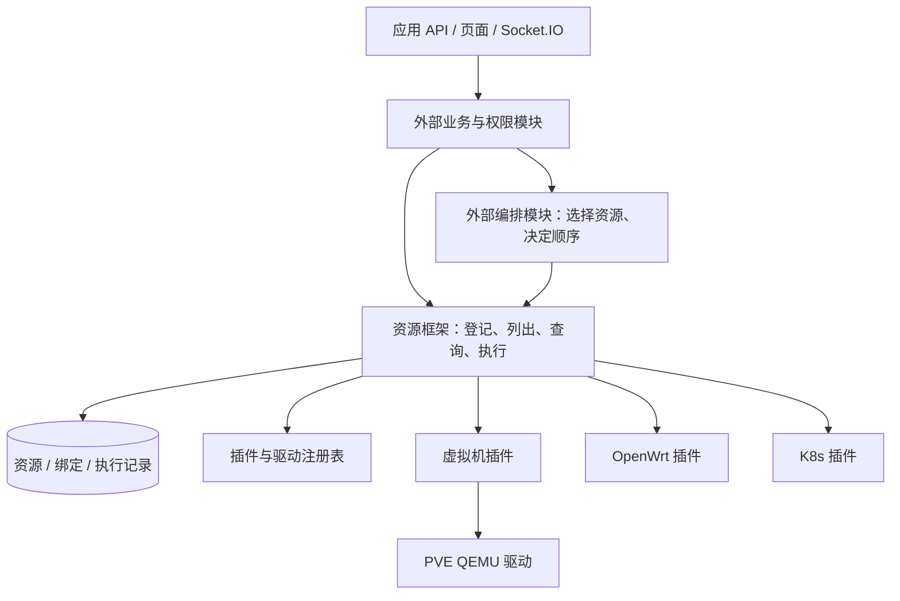

# 统一资源管理框架设计

状态：设计稿，接口与插件均待实现。  
创建日期：2026-09-02；更新日期：2026-09-03。  
适用项目：K8s Lab Platform；暂定包名：`resource_framework`。

平台整体的核心、鉴权、编排、实验模板与任务恢复设计见 [平台设计与接手指南](../platform-design/README.md)。本目录继续定义独立资源执行层。

## 定位

框架是资源管理与指令执行层，统一提供资源登记、列出、发现、查询、状态读取、指令分发和执行结果。插件负责将标准接口映射到具体平台。

操作是否应当执行、会影响哪些业务、资源之间如何依赖、何时执行下一条命令，由框架外部的业务、权限和编排模块决定。该边界同时适用于框架核心和基础插件，不能把移出的业务逻辑藏进插件。

## 文档

| 文档 | 内容 |
|---|---|
| [架构与插件契约](architecture.md) | 资源模型、执行接口、插件协议、执行记录、职责边界 |
| [虚拟机插件](plugins/virtual-machine.md) | 通用 VM 类型、动作和驱动协议 |
| [PVE 插件](plugins/pve.md) | 平台/节点/模板、QEMU 驱动、服务器隔离、外部任务 |
| [OpenWrt 插件](plugins/openwrt.md) | 路由器和 UCI 资源的独立操作 |
| [K8s 插件](plugins/k8s.md) | 集群登记、查询、安装指令及执行结果 |
| [实施与迁移计划](implementation-plan.md) | Issue #2、框架实施、应用接入、数据映射、验收 |
| [资源指令示例](examples/resource-commands.json) | 相互独立的资源查询与操作请求，不是工作流 |

## 职责划分

| 资源框架与插件负责 | 其他模块负责 |
|---|---|
| 资源身份、外部定位、登记和列表 | 资源的业务归属、用户权限、配额 |
| 提供类型、字段和支持的动作 | 判断某个用户当前可以执行哪些动作 |
| 参数类型/格式、目标解析、驱动匹配 | 判断操作是否合理、是否需要审批或投票 |
| 执行明确指令并返回状态/错误 | 评估停机、删除、配置变更的后果 |
| 跟踪一条指令的外部任务 | 多资源依赖、执行顺序、工作流和等待条件 |
| 输出单条操作的部分结果 | 失败重试、回滚补偿、级联清理 |
| 保存实际资源状态及采样时间 | 判断整个实验环境是否可用 |
| 连接和传输层的必要互斥 | IP/VLAN/端口分配及冲突规划 |

框架的技术校验用于准确执行指令：参数能解析、资源能唯一定位、插件支持动作、数据库记录一致。它不据此建立业务准入策略。例如，删除 VM 时不检查它是否承载 K8s，也不检查有没有学生正在使用；外部业务模块决定是否发送该命令，PVE 自身拒绝则返回平台错误。

## 架构

框架不提供工作流入口、依赖图、销毁计划或业务策略回调。应用调用前完成自身鉴权和决策；资源框架作为进程内库被调用。

## 基础插件

| 插件 | 类型与实现 |
|---|---|
| `virtual_machine` | 定义 `compute.vm/v1`、通用 VM 指令和驱动接口 |
| `pve` | 定义 `pve.platform/v1`、`pve.node/v1`、`pve.template/v1`，提供 `pve.qemu/v1` 驱动 |
| `openwrt` | 定义 router、VLAN、interface、DHCP、dnsmasq、zone、转发等资源，执行单项 UCI/服务指令 |
| `k8s` | 定义 `k8s.cluster/v1`，提供 API 查询和 `kubeasz/v1` 安装指令适配 |

同一台 VM 只有一个 `compute.vm` 记录。OpenWrt 连接独立于 PVE。K8s 插件接受准备好的节点和安装参数，不创建 VM 或网络。

实验环境仍可由外部模块注册为一个自定义逻辑资源类型，但其状态和操作由提供该类型的模块实现；框架不内置 `lab.environment` 控制器。`openwrt.network` 网络组合亦由外部模块表达，基础 OpenWrt 插件只提供独立配置资源。

## 核心约定

1. 对内使用 UUID `resource_id`，对外绑定包含明确平台作用域，修复同节点名/VMID 的跨服务器冲突。
2. 同一外部平台可以有多个连接地址；调用者提供明确 domain/connection 关联，不根据业务名称猜测。
3. 登记资源与在外部创建资源是不同接口；遗忘登记与删除外部对象也是不同接口。
4. 外部任务已接受、执行完成、资源实际状态分别记录。
5. 每条指令独立执行。框架不推断它和其他指令的依赖，也不保证它们构成某个业务流程。
6. 框架可去重同一个请求并继续查询已知外部任务；是否再次执行失败或结果不明的命令由调用方决定。
7. 单条指令需要多个底层 API 调用时，插件可以实现协议内部顺序，但不自行触发其他资源的业务动作。

## 本次边界修订

旧稿中的 owns/depends_on 关系图、DAG 调度、授权策略入口、删除保护、级联清理、自动补偿、地址分配、实验环境蓝图编译全部移出框架。旧蓝图示例由独立指令示例替代，后续实现以本稿为准。

现有应用的权限和关机投票继续存在于应用层。职责迁出是代码归属调整，不是取消应用已有控制。首版以当前代码实际使用的 PostgreSQL 为存储基线。
