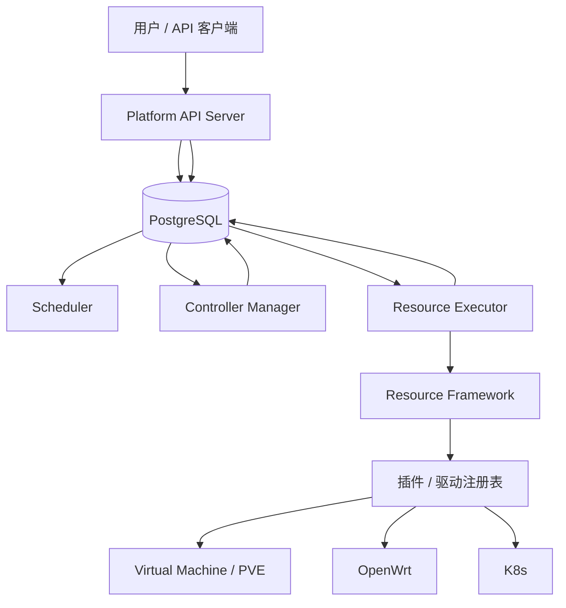

# 统一资源管理框架设计

状态：设计稿，接口与插件均待实现。更新日期：2026-09-04。暂定包名：`resource_framework`。

平台整体的 API Server、Scheduler、Controller Manager、Resource Executor、Environment、PlanRevision、finalizer 与恢复设计见[平台控制面设计](../platform-design/README.md)。本目录定义 Resource Executor 下方可独立使用的资源执行库。

## 1. 定位

框架统一提供 Resource/Binding/Connection 登记、发现、查询、Observation、Operation 技术执行和插件分发。插件将固定的标准指令映射到 PVE、OpenWrt、K8s 等外部平台。

操作是否应产生、资源放在哪里、业务是否允许、多个资源怎样排序、删除是否完成，由 API admission、Scheduler 和 Controller 决定。框架及基础插件不能把这些职责以“保护逻辑”或隐式级联方式收回。

## 2. 与控制面的关系

EnvironmentController 或直接资源 API 经授权后创建持久化 Operation；Executor 从数据库领取并调用框架。API 不同步调用插件，Controller 不直接访问后端。框架不读取 Environment、PlanRevision、Task、课程或 finalizer。

## 3. 职责划分

| 资源框架与插件负责 | 控制面负责 |
|---|---|
| resource_id、domain、binding、connection 和外部定位 | Environment spec/status、业务归属和用户权限 |
| 类型、字段、动作和 observation schema | 模板/Profile、placement、allocation、PlanRevision |
| 参数类型/格式、目标解析、驱动匹配 | 每条新 Operation 前的实时授权与教学规则 |
| 执行固定目标的一条 Operation | 跨资源顺序、readiness、失败决策和 cleanup recipe |
| 外部任务 poll、部分结果和 unknown | 是否新 attempt、重规划、补偿或人工处理 |
| Resource 实际状态和 observedAt | Environment conditions 和聚合 Ready |
| 单资源/单 domain 的技术互斥 | 业务影响、配额、共享使用和删除许可 |

框架的技术校验只用于准确执行：参数可解析、目标唯一、绑定/连接版本匹配、动作受支持。VM 是否承载 K8s、是否有学生使用、是否通过投票，均不是框架判断。

## 4. 基础插件

| 插件 | 类型与实现 |
|---|---|
| virtual_machine | `compute.vm/v1`、通用 VM 指令和驱动协议 |
| pve | `pve.platform/node/template`，提供 `pve.qemu/v1` 驱动和 UPID poll |
| openwrt | router、VLAN、interface、DHCP、zone、forward 等独立 UCI 指令 |
| k8s | `k8s.cluster/v1`、API observation 和可恢复的 kubeasz 远端作业 |

同一台外部 VM 只有一个 compute.vm 当前绑定。OpenWrt connection 独立于 PVE。K8s deploy 接受完整 inventory，不创建 VM 或网络。

## 5. 核心约定

1. 对内使用 UUID resource_id；外部身份始终带 domain。PVE VM 目标态 `(domain_id,vmid)` 唯一，node 只是可变 locator。
2. connection 是访问端点，不等同 domain；多个 connection 可以由接入层明确关联同一平台。
3. register、create、unregister 和 delete 是四种不同语义。
4. create 在外部调用前生成 Resource 和 provisional Binding；登记状态与外部存在状态分开。
5. 每个外部副作用先持久化 Operation；Executor 固定 binding/connection/plugin/secret 版本快照后执行。
6. Operation 使用 lease/claimRevision；已知 externalTaskRef 重启后继续 poll，未知提交不自动重发。
7. request_id 只做服务端作用域内传输去重，不把业务上相似的两个命令自动合并。
8. 单条命令内部必要的 clone→poll→configure 可以由插件完成，但不得触发其他资源动作。
9. OpenWrt 写操作按 domain 跨进程串行；首版不支持跨 Operation 的 `apply_mode=none` 候选配置。
10. delete 成功可关闭 Resource 当前绑定，但不会级联其他资源；finalizer 和 allocation 由控制面维护。

## 6. 文档

| 文档 | 内容 |
|---|---|
| [架构与插件契约](architecture.md) | 数据模型、Operation、绑定快照、Executor、插件协议 |
| [虚拟机插件](plugins/virtual-machine.md) | VM 类型、动作和驱动协议 |
| [PVE 插件](plugins/pve.md) | domain/VMID、QEMU 驱动、UPID 和恢复 |
| [OpenWrt 插件](plugins/openwrt.md) | 独立 UCI 资源、apply 和 domain 锁 |
| [K8s 插件](plugins/k8s.md) | 集群 observation、可恢复安装作业 |
| [实施与迁移计划](implementation-plan.md) | 分阶段实现、身份迁移和验收 |
| [资源指令示例](examples/resource-commands.json) | 相互独立的调用示例，不是工作流 |

## 7. 首版排除项

资源依赖图、Environment controller、Task workflow、业务 allocation、自动补偿、级联清理、地址规划、用户授权策略和模板编译均不属于资源框架。以后可以注册新资源类型，但不能通过扩张核心来绕过控制面对象契约。
