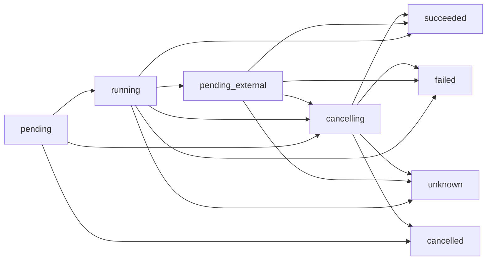

# 架构、数据模型与插件契约

本文对应[总体设计](README.md)，定义资源执行层，不定义业务流程。所有接口均为待实现设计。

## 1. 包边界

```text
resource_framework/
  contracts/          # 资源、指令、结果、插件与驱动协议
  core/               # 登记、列表、目标解析、指令分发
  persistence/        # 资源、外部绑定、单条执行记录、迁移
  runtime/            # 执行器、外部任务轮询、技术互斥
resource_plugins/
  virtual_machine/
  pve/
  openwrt/
  k8s/
modules/resource_integration/
  bootstrap.py        # Resource Executor 显式初始化框架
  legacy.py           # 旧 ID 与响应格式适配
  operations.py       # 控制面 Operation admission 与框架适配
  events.py           # 应用负责事件接收者与广播
  secrets.py          # 现有凭据存储适配
```

业务权限、关机投票、Environment reconcile、Scheduler、PlanRevision、finalizer 和地址分配位于控制面。核心与基础插件不依赖 Flask、current_user、教师/学生/课程、Environment 或 Task，也不包含可注入的业务审批钩子。

## 2. 资源、平台作用域和连接

| 概念 | 含义 |
|---|---|
| plugin_id | 实现包，如 pve |
| type | 版本化资源类型，如 compute.vm/v1 |
| driver_id | 类型的具体平台实现，如 pve.qemu/v1 |
| domain_id | 外部标识的作用域，如一个 PVE 平台或一台路由器 |
| connection_id | 访问该 domain 的端点与凭据引用 |
| resource_id | 框架内部 UUID，关闭登记后不复用 |
| external_key | 插件规范化的域内身份，如 VMID |
| locator | 当前 API 操作路径，如 node、UCI package/section |

多个 connection 可访问一个 domain。该映射由接入模块提供；框架只校验 connection 与绑定的 domain 一致。识别两个旧配置是否实际属于同一设备是接入/迁移工作，不能靠默认服务器解决歧义。

资源登记不附带生命周期所有者、删除保护或业务权限。labels/metadata 可保存不透明的外部关联值供检索，框架不解释它们，不根据标签决定是否执行指令。业务归属和关系的事实来源位于其他模块。

修改端点不改变 resource_id。平台内节点迁移可更新 locator；检测到外部对象已被替换时返回 IdentityMismatch，由调用方明确解除旧绑定或重新登记，不能把旧指令悄悄发给新对象。

## 3. 数据模型

| 表 | 字段与约束 |
|---|---|
| rf_plugins | ID、版本、SDK major、加载状态、迁移版本 |
| rf_resource_types | type_key/schema_version 唯一、插件 FK、字段 schema、支持动作 |
| rf_domains | ID、插件 FK、域类型、外部域标识 |
| rf_connections | ID、domain FK、非敏感端点配置、secret_ref、revision、登记状态 |
| rf_resources | UUID、类型/版本 FK、name、attributes JSON、metadata/labels、registration_state、existence_state、revision、时间 |
| rf_bindings | resource FK、domain FK、connection FK、driver_id、external_key、locator、identity_evidence、binding_state、binding_revision、retired_at |
| rf_resource_status | resource PK/FK、类型专属状态、observed_at、status_revision、stale、查询错误 |
| rf_operations | UUID、资源 FK、action、规范化输入/摘要、server_scope/request_id、correlation_id、binding/connection/secret/plugin 快照、状态、lease_owner/lease_until/claim_revision、输出/错误、外部任务引用、执行数据、时间 |
| rf_migrations | 插件/核心 ID + 版本唯一、checksum、执行结果 |

结构约束：

- 每个资源最多一个当前绑定；当前 `(domain_id,driver_id,external_key)` 唯一，插件可补充更严格的平台身份约束。
- `(connection_id,domain_id)` 复合 FK 保证目标端点和资源域一致。
- 需要数据库索引/唯一性的 VMID、UCI section 等放在插件扩展表，不只放 JSON。
- resource_id 是记录身份，attributes 是已知配置；registration_state 与外部 existence_state=pending/present/absent/unknown 分开。资源框架不存在 Environment desiredState 或业务 generation。
- 修改登记元数据采用 revision 防止丢失更新。所有变更 Operation 在受理时强制固定 binding_id/revision、connection_id/revision、secret version 和插件版本；调用方可附 expected_binding_revision 作为额外前置条件。
- create 在发送外部调用前预分配 resource_id，并在 external_key 可知时建立 provisional binding、占用当前身份唯一键。失败记录不删除。
- 未完成执行的目标、规范化输入和插件版本固定保存；exec_data 仅供该插件跟踪一条指令，核心不将它解释成步骤图。
- server_scope 由宿主可信代码生成；caller_ref/correlation_id 只用于追踪，不作为权限事实。
- 凭据由 SecretStore 引用提供，日志、普通资源结果和操作错误不输出凭据正文。

不建立资源依赖表、生命周期所有权表、删除策略字段、工作流步骤表或业务 allocation 表。旧业务 ID→resource_id 映射留在宿主业务数据库。

## 4. 登记、发现和列表

- `discover(connection_id, type, cursor)`：向平台查询外部候选资源；可分页，不自动写入所有候选。
- `register(type, driver_id, connection_id, external_identity, attributes)`：绑定已有外部资源；保证身份唯一，不修改外部对象。
- `list_resources(filters, cursor, limit)`：列出已登记资源，支持 IDs、类型、domain、connection、labels 过滤。
- `get_resource(resource_id)`：读取登记详情和最后观察结果。
- `observe(resource_id)`：向插件查询实际状态，保存采样时间及错误。
- `unregister(resource_id)`：关闭登记并保留历史执行记录，不调用外部删除，不检查其他业务是否使用它。已经接受的指令仍按固定目标执行；取消需要调用方单独请求。

关闭平台/节点的登记不会级联关闭 VM；连接记录与展示资源分别管理。连接关闭后，新指令返回 ConnectionUnavailable。已经接受的指令使用固定连接版本完成或返回执行错误。历史 FK 通过保留关闭记录满足，不用“有业务依赖”作为拒绝关闭的理由。

列表接口只执行调用方提供的过滤条件。应用层先确定允许访问的 ID/查询范围，再调用框架并处理对用户的输出。

## 5. 指令接口

```python
class ResourceService:
    def list_resources(self, query: ResourceQuery) -> ResourcePage: ...
    def register(self, request: RegisterRequest, context: CallContext) -> Resource: ...
    def get_resource(self, resource_id: str) -> Resource: ...
    def observe(self, resource_id: str, context: CallContext) -> Observation: ...
    def create(self, request: CreateRequest, context: CallContext) -> Operation: ...
    def execute(self, resource_id: str, action: str,
                parameters: dict, context: CallContext) -> Operation: ...
    def get_operation(self, operation_id: str) -> Operation: ...
    def cancel(self, operation_id: str) -> CancelResult: ...
    def unregister(self, resource_id: str, context: CallContext) -> Resource: ...

class OperationRuntime:
    def claim(self, operation_id: str, worker_id: str) -> OperationLease: ...
    def run(self, lease: OperationLease) -> ExecutionResult: ...
    def poll(self, lease: OperationLease) -> ExecutionResult: ...
    def request_cancel(self, operation_id: str, context: CallContext) -> CancelResult: ...
```

CreateRequest 包含 type、driver_id、connection_id、明确创建参数和可预知 external identity。ResourceService 只在事务中产生 resource_id、provisional binding 和 Operation；OperationRuntime 由 Executor 在提交后领取并调用插件。两者不分配业务子网、不选择模板、不寻找前置资源。

CallContext 包含宿主生成的 server_scope、request_id（可选）、caller_ref/correlation_id 和查询等待选项；不包含角色、投票许可、销毁计划或依赖列表。服务端 request 去重作用域不能由普通客户端伪造。

ResourceService.execute 依次完成以下技术受理工作：

1. 解析资源和当前绑定；找不到目标或调用前置版本不匹配则返回技术错误。
2. 找到已加载插件/驱动，确认其实现该 action。
3. 校验参数 schema、类型和编码要求。
4. 记录指令并固定 binding/connection/secret/plugin 快照，提交后进入 pending。
5. 返回 operation_id；Executor 后续通过 OperationRuntime 保存平台结果、实际错误和执行进度。

这些步骤不查询资源的业务使用者，不生成审批请求，不评估是否影响集群，也不等待其他资源变成 Ready。插件不得将这些判断作为自己的隐式前置条件。

一条 create_vm 命令可能需要 clone、轮询 clone、配置新 VM；这是完成该指令的底层协议实现。它不会进一步创建 OpenWrt 网络或自动部署 K8s。需要这些后续动作时，由调用方分别发送指令。

## 6. 执行记录与异步结果

执行状态：`pending / running / pending_external / succeeded / failed / cancelling / cancelled / unknown`。

- pending：已保存、尚未执行。
- running：正在提交或执行当前指令。
- pending_external：平台返回外部任务，等待其完成。
- succeeded/failed：平台或安装器已给出可确认的完成结果。
- cancelling：已请求取消，但尚未得到后端确认；不调度新的执行阶段。
- cancelled：已确认未执行或平台取消成功；不表示反向操作已完成。
- unknown：连接丢失、重启等导致外部结果不可确认。



单条执行记录持久化在 PostgreSQL。Executor 使用 lease_owner、lease_until 和 claim_revision 领取，旧领取者的比较更新必须失败；已知 external_task_ref 可在重启后继续查询。提交结果未知时返回 unknown，不自动再次发送命令。只有控制面明确批准的新 attempt 才使用新的 request_id。

可选 request_id 的唯一作用域是可信 server_scope + request_id；相同请求内容返回同一执行记录，内容不同为 RequestConflict。这是传输去重，不识别两条命令是否属于同一业务流程。

插件可返回 exec_data 和部分结果（例如 VMID 已产生但配置失败、UCI 已提交但 reload 失败）。框架原样保留，外部模块决定补偿、清理或继续。核心不自动生成逆向操作、重试计划或下一条命令。

同一 Resource 默认串行变更 Operation；OpenWrt 写入还使用 PostgreSQL advisory lock 或数据库租约按 domain 跨进程串行。技术互斥不构造业务依赖排序；不同资源需要严格先后时由控制面根据 PlanRevision 和 Operation 状态决定。

## 7. 状态

资源状态来自插件观察：VM 电源、UCI 配置、API 可达性、K8s 节点状态等。登记状态 `active/closed`、指令执行状态、外部实际状态分别保存。

操作接受不意味着 VM 已开机；安装命令退出成功也不表示业务达到可用标准。框架可以返回安装退出码和节点 Ready 数，整个实验环境是否可用由调用方判断。

缓存键是 resource_id。异步采样保存绑定版本和采样序号，旧响应不能覆盖新绑定/新采样。单个连接失败只使相应状态 stale，不清空其他平台的数据。可提供周期性只读刷新，不包含自动纠偏或按依赖聚合健康。

## 8. 插件协议

```python
class ResourcePlugin:
    def describe(self) -> PluginDescriptor: ...
    def register_handlers(self, registry: HandlerRegistry) -> None: ...

class ResourceHandler:
    def describe_actions(self) -> list[ActionDescriptor]: ...
    def discover(self, ctx, connection, cursor=None) -> DiscoveryPage: ...
    def normalize_identity(self, connection, locator) -> ExternalIdentity: ...
    def observe(self, ctx, target) -> Observation: ...
    def execute(self, ctx, target, action, parameters) -> ExecutionResult: ...
    def poll(self, ctx, external_task_ref, exec_data) -> ExecutionResult: ...
```

create 使用带预分配 UUID 和明确 connection/创建参数的 target；其他动作使用固定外部绑定。平台不支持的 discover/poll/cancel 不声明对应能力。

ActionDescriptor 定义 name、input_schema、result_schema、是否异步、技术完成条件、支持的取消方式。支持能力只反映实现和后端协议，不结合教师/学生权限，也不动态排除“可能有影响”的操作。

ExecutionContext 只提供 operation_id、连接/transport、凭据解析、日志及执行数据保存。没有 authorize、plan、child_operations、dependency_graph、allocation、rollback 等服务。注册表的软件版本依赖仅解决插件加载兼容性，不是资源业务依赖。

ExecutionResult 包含 state、output、error、external_task_ref、exec_data、observed_state（可选）。错误至少包含 code、中文 message、provider_code、details；保留平台拒绝原因，不包装成自行推断的业务结论。

```json
{
  "plugin_id": "pve",
  "version": "0.1.0",
  "sdk_major": 1,
  "requires": {"virtual_machine": ">=0.1.0,<0.2.0"},
  "resource_types": ["pve.platform/v1", "pve.node/v1", "pve.template/v1"],
  "drivers": [{"id": "pve.qemu/v1", "contract": "compute.vm-driver/v1"}],
  "connection_types": ["pve.api/v1"]
}
```

SDK 版本不兼容或 ID 重复时拒绝加载并报告。插件停用后保留资源/历史记录，新命令返回 PluginUnavailable；未完成命令不能由不兼容版本静默重放。升级和停用时机由部署模块决定，核心不根据资源的业务使用情况制定停用策略。

## 9. 应用接入与 HTTP 映射

首版框架是进程内库。现有应用的登录、鉴权、投票、查询范围过滤、事件接收者选择在调用框架之前或输出给用户之前完成；它们不迁入框架，不通过添加无鉴权公共路由替代。

应用已具备 authz/security_service 授权、audit 脱敏审计和 credential_store 加密适配。新旧资源路由继续复用这些模块，保持 CSRF/Origin 与原始提供器写权限约束；API 经 admission 后只创建持久化 Operation，Resource Executor 才调用 SDK。

| 应用 HTTP 接口 | 对应框架调用 |
|---|---|
| GET /api/resource-types | 已加载类型与支持动作描述；用户可见范围由应用过滤 |
| GET /api/resources | list_resources |
| POST /api/resources/register | register 已有资源 |
| POST /api/resources | create 明确类型/连接/参数的外部资源 |
| GET /api/resources/&lt;id&gt; | get_resource |
| PATCH /api/resources/&lt;id&gt; | 更新登记元数据；外部配置变更使用 configure 指令 |
| POST /api/resources/&lt;id&gt;/observe | observe |
| POST /api/resources/status/batch | 各 ID 独立查询最后状态 |
| POST /api/resources/&lt;id&gt;/actions/&lt;action&gt; | execute |
| POST /api/resources/&lt;id&gt;/unregister | unregister |
| GET /api/resource-operations/&lt;id&gt; | get_operation |
| POST /api/resource-operations/&lt;id&gt;/cancel | cancel（后端支持时） |

create/execute 被接受后返回 202 + resource_id/operation_id。技术参数错误 400/422，资源不存在 404，身份/请求版本冲突 409，插件不可用 503。应用自己产生认证/授权错误，不要求框架认识 PolicyDenied。

业务停止 VM 的示例：API 完成权限和投票判断 → 持久化 stop Operation → Executor 调用 execute → 跟踪结果。框架只执行 stop，不知道此次请求有没有投票。

错误示例：ResourceNotFound、IdentityConflict、IdentityMismatch、BindingRevisionConflict、InvalidParameters、UnsupportedAction、ConnectionUnavailable、ProviderError、RequestConflict、ExecutionOutcomeUnknown。不存在框架级 DependencyInUse 或 DeletePlanRequired。

## 10. 删除与批量操作边界

收到 VM delete 指令，插件删除指定 VM；不检查它承载什么，不删除其他资源，也不自动停止 VM。当前 VM 动作契约中，先停止再删除由调用方分别提交。平台原生动作的效果及限制按协议执行，平台拒绝则返回实际错误。

外部 delete 确认成功后，框架记录对象不存在、关闭当前绑定及登记，历史执行记录保留；部分失败或 unknown 时只记录已知结果。该更新维护资源记录与执行事实的一致性，不触发其他资源的操作。

若调用者先删除依赖项，框架不会为其纠正顺序。批量接口若后续提供，仅表示一组独立调用及逐项结果；没有原子工作流、依赖排序或整批回滚。

框架可以存储外部模块登记的逻辑资源并调用其 handler，但不解释组合语义。控制面将模板、Placement 和 PlanRevision reconcile 为一次性 Operation；框架只接收 Resource Executor 提交的固定技术请求。见[独立指令示例](examples/resource-commands.json)。
